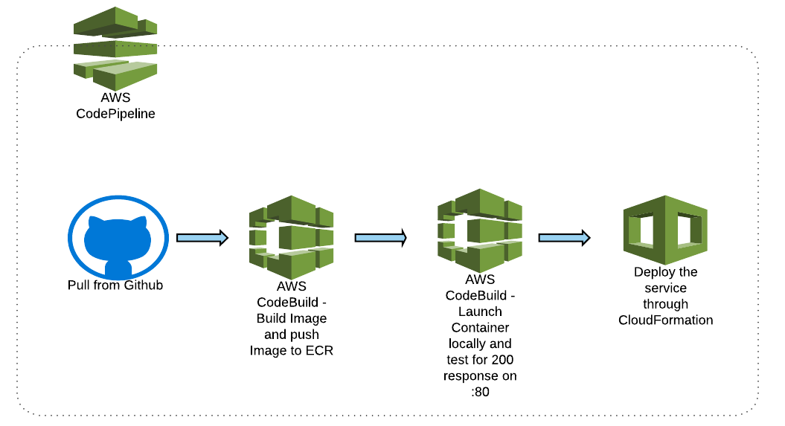
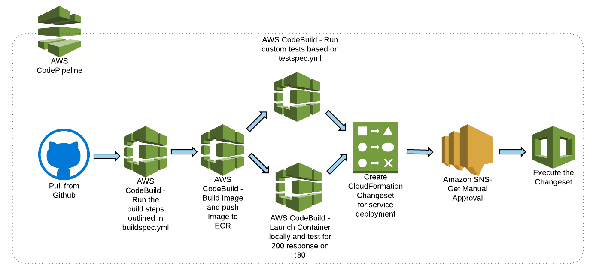
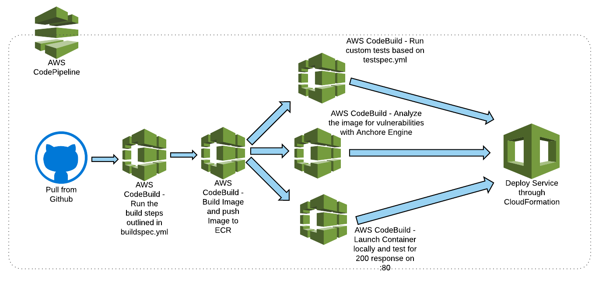

# Overview
This repository contains examples for service deployment pipelines. These pipelines are deployed as service catalog products. 

Currently, there are 3 flavors of deployment pipelines in the repository, ***[devops-springboard-pipelines](https://github.com/Flux7Labs/devops-springboard-pipelines)*** and these are provided to the end user as [ServiceCatalog](https://aws.amazon.com/servicecatalog/) products. They are:

1. **_deploy-pipeline-simple_** - This is a simple pipeline. The stages of this pipeline are as shown in the following diagram.

	

2. **_deploy-pipeline-with-approval_** - This pipeline has all the stages described in *deploy-pipeline-simple* along with the following additional stages:

    1. Run custom build based on *buildspec.yml* present in the application repository.

    2. Run custom tests based on *testspec.yml* present in the application repository.

        1. Create [CloudFormation Changeset](https://docs.aws.amazon.com/AWSCloudFormation/latest/UserGuide/using-cfn-updating-stacks-changesets.html) before deploying the service through CloudFormation.

        2. Get Manual approval.

        3. Deploy the changeset after it is approved.

	The following diagram describes the stages of this pipeline:

	

3. **_deploy-pipeline-with-security_** -  This pipeline has all the stages described in *deploy-pipeline-simple* along with the following additional stages:

    3. Run custom build based on *buildspec.yml* present in the application repository.

    4. Run custom tests based on *testspec.yml* present in the application repository.

    5. Analyze the image through [anchore-engine](https://github.com/anchore/anchore-engine) for any security vulnerabilities and fail if any vulnerabilities found.

The following diagram describes the stages of this pipeline.

   
